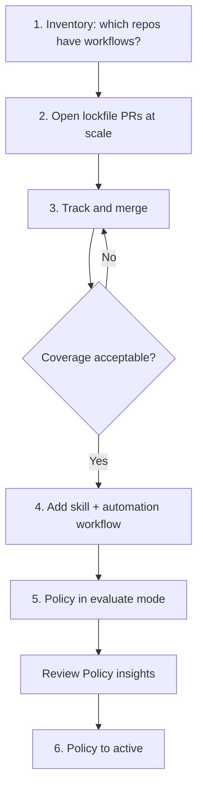

# Rolling out lockfiles across an organization or enterprise

Locking one repository is a command. Locking a few hundred or a few thousand is
a migration — and you can run that migration today, with primitives that already
exist. You can execute the CLI across every repository you own, open the
resulting pull requests, push the automation workflow and skill to all of them,
and then require a lockfile by policy.

This document describes that sequence: open lockfile pull requests across every
repository, track them to merge, add the per-repository automation, then turn on
the policy that requires a lockfile.

The sequence is the same whether you are an organization owner or an enterprise
owner. Only two things differ: how you enumerate repositories, and which level
you create the policy at. Both are called out where they matter. **Require
lockfile** is available at the enterprise, organization, and repository levels,
so you can also pilot it on a single repository before committing to a wider
rollout.

> [!NOTE]
> This is a rollout pattern built from the primitives available today, not a
> native bulk-provisioning feature. It works now, and it is expected to get
> simpler as central management lands.

## The end state

Actions policies are generally available, and one of the workflow execution
protections they can apply is **Require lockfile**, which requires workflows to
use a lockfile.

Order matters. Turning the policy on before repositories have lockfiles blocks
their workflows. The sequence below gets lockfiles in place first and enables
enforcement last.



## 1. Inventory

Find the repositories that have workflows at all, since those are the only ones
this applies to.

For a single organization, list repositories directly:

```bash
gh repo list ORG --limit 1000 --no-archived \
  --json nameWithOwner --jq '.[].nameWithOwner' > repos.txt
```

Across an enterprise, iterate the organizations first. There is no REST endpoint
that lists an enterprise's organizations, so this one is GraphQL:

```bash
gh api graphql --paginate -f enterprise=ENTERPRISE -f query='
  query($enterprise: String!, $endCursor: String) {
    enterprise(slug: $enterprise) {
      organizations(first: 100, after: $endCursor) {
        nodes { login }
        pageInfo { hasNextPage endCursor }
      }
    }
  }' --jq '.data.enterprise.organizations.nodes[].login' \
  | while read -r org; do
      gh repo list "$org" --limit 1000 --no-archived \
        --json nameWithOwner --jq '.[].nameWithOwner'
    done > repos.txt
```

Both listings need `read:org`.

Code search narrows that list to repositories that actually have workflows:

```bash
gh api -X GET search/code \
  -f q='path:.github/workflows org:ORG' \
  --jq '.items[].repository.full_name' | sort -u
```

Code search is indexed, not authoritative, so treat the result as a filter
rather than a guarantee. To check a specific repository for a lockfile, ask for
the file directly:

```bash
gh api "repos/$REPO/contents/.github/workflows/actions.lock" --silent 2>/dev/null \
  && echo "locked" || echo "not locked"
```

That per-repository check is what you should use for coverage numbers. Searching
for `filename:actions.lock` undercounts.

## 2. Open lockfile pull requests at scale

Both options here are programmatic and run against your whole repository list.
Pick based on how much per-repository judgment you expect to need.

**Script it.** Clone, run `gh actions-lock`, branch, push, open a pull request,
in a loop over `repos.txt`. Fully deterministic, no agent involved, and for a
list where you expect most repositories to lock cleanly it is the simpler
choice:

```bash
while read -r repo; do
  tmp=$(mktemp -d)
  gh repo clone "$repo" "$tmp" -- --quiet || continue
  git -C "$tmp" checkout -b actions-lock --quiet
  (cd "$tmp" && gh actions-lock --no-interactive) || { echo "$repo: skipped"; continue; }
  git -C "$tmp" add -A
  git -C "$tmp" diff --cached --quiet && { echo "$repo: nothing to do"; continue; }
  git -C "$tmp" commit -m "Add Actions lockfile" --quiet
  git -C "$tmp" push -u origin actions-lock --quiet
  (cd "$tmp" && gh pr create --fill)
done < repos.txt
```

The `add -A` matters: the lockfile is a new file, and the run also rewrites
workflow YAML to narrow refs and migrate `./…` to `$/…`. Both belong in the
commit. The `diff --cached --quiet` check keeps already-locked repositories from
producing empty pull requests, so the loop is safe to re-run over the full list.

**Dispatch an agent.** At larger scale the problem is not running the command,
it is that some fraction of repositories will not lock cleanly. A workflow uses
an unresolvable local action, a dependency is a composite that reaches a `./…`
path, a repository has no workflows worth locking. The loop above skips those
silently; an agent can read the finding and react:

```bash
cat > /tmp/lock-prompt.md <<'EOF'
Add a GitHub Actions lockfile to this repository.

1. Install the extension: gh extension install github/gh-actions-lock
2. Run: gh actions-lock --no-interactive
3. The command also rewrites `uses:` refs to full semver tags and migrates
   same-repo `./…` action references to `$/…`. Both are intended. Include them.
4. Verify with: gh actions-lock --verify
5. Open a pull request with the lockfile and any rewritten workflow files.

If locking fails, do not force it. Never write or edit the lockfile yourself —
it is generated only by the CLI. Open no pull request and report the exact
finding instead.
EOF

while read -r repo; do
  gh agent-task create -R "$repo" -F /tmp/lock-prompt.md
done < repos.txt
```

> [!NOTE]
> `gh agent-task` requires an OAuth user token. It fails with "this command
> requires an OAuth token" when `GH_TOKEN` is set to an installation or
> fine-grained token, so run it as a logged-in user with `gh auth login`.

Stagger dispatch and stay inside your API rate limits. Start with a pilot batch
of 10 to 20 repositories before running the full list.

## 3. Track progress and merge

`gh agent-task list` reports the state of every task and its pull request, which
is the progress dashboard:

```bash
gh agent-task list --limit 200 \
  --json repository,state,pullRequestNumber,pullRequestState,pullRequestUrl
```

Count what is left:

```bash
gh agent-task list --limit 200 --json repository,pullRequestState \
  | jq -r 'group_by(.pullRequestState)[] | "\(.[0].pullRequestState): \(length)"'
```

There is no bulk-merge API. The closest equivalent is enabling auto-merge on
each pull request so they land as their checks pass:

```bash
gh agent-task list --limit 200 --json pullRequestUrl,pullRequestState \
  | jq -r '.[] | select(.pullRequestState == "OPEN") | .pullRequestUrl' \
  | xargs -n1 -P4 gh pr merge --auto --squash
```

Auto-merge must be enabled on the repository, and the pull request still has to
satisfy branch protection. Repositories requiring review will sit until someone
approves them — which for a change that alters what executes on your runners is
reasonable.

Review the lockfile diffs. A first lockfile records the commit for every action
the repository already uses; if one of those was already compromised, locking
pins the compromise. Locking makes dependencies visible and stable, not
retroactively safe.

If a lockfile looks wrong, close the pull request and re-run the CLI. Lockfiles
are generated, and nothing in this rollout should ever write one by hand.

## 4. Add the skill and the automation workflow

Once a repository has a lockfile, it needs to stay current. That is the
[per-repository developer experience](./repository-developer-experience.md): a
Copilot skill for the authoring path and a workflow for the push and pull
request path.

Roll these out as a second wave, after the lockfile pull requests have merged.
The automation workflow's `verify` job fails on a repository with no lockfile,
so shipping it first produces failing checks everywhere.

Both files are static, so this wave does not need an agent. A script is enough.

Pushing a branch that adds anything under `.github/workflows/` requires the
`workflow` OAuth scope, so check for it once before the loop rather than
discovering it on the first repository:

```bash
scopes=$(gh api -i user 2>/dev/null | sed -n 's/^[Xx]-[Oo]auth-[Ss]copes: //p' | tr -d '\r')
if [ -n "$scopes" ] && ! printf '%s' "$scopes" | grep -q '\bworkflow\b'; then
  echo "Token lacks the 'workflow' scope; pushes touching .github/workflows/ will be rejected."
  echo "Current scopes: $scopes"
  echo "Fix: gh auth refresh -h github.com -s workflow"
  [ -n "$GH_TOKEN" ] && echo "Note: GH_TOKEN is set and overrides your logged-in account. Unset it to use that account instead."
  exit 1
fi
```

An empty `scopes` means a fine-grained or app token, which does not report
classic scopes. Those need `Workflows: write` on the target repositories, so the
check passes them through rather than guessing.

Then the loop itself:

```bash
while read -r repo; do
  gh api "repos/$repo/contents/.github/workflows/actions-lock.yml" --silent 2>/dev/null \
    && { echo "$repo: already present"; continue; }
  tmp=$(mktemp -d)
  gh repo clone "$repo" "$tmp" -- --quiet || continue
  git -C "$tmp" checkout -b actions-lock-automation --quiet
  mkdir -p "$tmp/.github/workflows" "$tmp/.github/skills/actions-lock"
  cp docs/examples/actions-lock-workflow.yml "$tmp/.github/workflows/actions-lock.yml"
  cp docs/examples/actions-lock-SKILL.md "$tmp/.github/skills/actions-lock/SKILL.md"
  git -C "$tmp" add -A
  git -C "$tmp" commit -m "Add Actions lockfile automation" --quiet
  git -C "$tmp" push -u origin actions-lock-automation --quiet
  (cd "$tmp" && gh pr create --fill)
done < locked-repos.txt
```

Copy from [`examples/`](./examples):

- [`examples/actions-lock-workflow.yml`](./examples/actions-lock-workflow.yml) →
  `.github/workflows/actions-lock.yml`
- [`examples/actions-lock-SKILL.md`](./examples/actions-lock-SKILL.md) →
  `.github/skills/actions-lock/SKILL.md`

## 5. Enable the policy in evaluate mode

Actions policies exist at three levels, and **Require lockfile** is available at
each. Where you create the policy determines how far it reaches:

| Level | Where | Reaches |
| --- | --- | --- |
| Enterprise | **Policies → Actions → Policies** | Selected organizations and their repositories |
| Organization | **Settings → Actions → Policies** | Repositories in that organization |
| Repository | **Settings → Actions → Policies** | That repository |

The policy form is the same at every level. The only difference is which
targeting fields appear, since a narrower level has already decided the broader
scope:

| Field | Value | Where it appears |
| --- | --- | --- |
| Policy Name | e.g. `Require Actions lockfile` | All levels |
| Enforcement status | **Evaluate** to start | All levels |
| Target organizations | All, or a dynamic list by name | Enterprise only |
| Target repositories | All repositories, or targeting criteria | Enterprise and organization |
| Target workflows | All workflows, or specific paths | All levels |
| Workflow execution protections | **Require lockfile** | All levels |

Evaluate mode runs the rule without blocking, so you can see which workflow runs
*would* fail. Results appear under **Policy insights**.

Pick the level that matches how far along the migration is. A repository-level
policy is the natural fit for a pilot: one team can turn on enforcement for
their own repository and live with it before anything is required of anyone
else. It is also the right tool for a repository that finished migrating well
ahead of its organization.

An organization-level policy is the better place to start for the migration
proper, even if you own the enterprise. It contains the blast radius, and it
lets one organization finish migrating and enforce while others are still
opening pull requests. Move the rule up to the enterprise once the pattern
holds.

Policies at different levels can apply to the same repository at once. Before
relying on a narrower policy to relax a broader one, confirm the behavior in
**Policy insights** rather than assuming it.

Two targeting details make a staged rollout practical:

- **Repository targeting criteria** can match on custom properties, so you can
  tag repositories as they finish migrating and scope enforcement to that set.
  Read a repository's properties with
  `gh api repos/OWNER/REPO/properties/values`.
- **Workflow targeting** scopes the rule to specific workflow paths, so you can
  require lockfiles for deployment workflows before CI.

GitHub features including Dependabot, code scanning, Codespaces prebuilds, and
Pages are exempt from workflow execution protections.

## 6. Enforce

When Policy insights shows no unexpected failures, change enforcement status
from **Evaluate** to **Active**.

Leave the per-repository `verify` job in place. The policy blocks a workflow run
that has no lockfile; the `verify` job tells an author their lockfile is stale
while they are still in the pull request, which is a better place to find out.

## What the policy does and does not cover

**Require lockfile** requires workflows to use a lockfile. It is distinct from
the older allowed-actions setting, **Require actions to be pinned to a
full-length commit SHA**, which lives under the actions and reusable workflows
policy rather than under workflow execution protections.

The two are complementary, and the lockfile is the stronger of the pair:

| | SHA pinning policy | Lockfile |
| --- | --- | --- |
| Direct actions pinned | Yes | Yes |
| Transitive dependencies pinned | No | Yes |
| Repository identity recorded | No | Yes (`owner_id`, `repo_id`) |
| Visible in pull request diffs | Ref only | Resolved commit per dependency |

Neither table row covers job-level reusable workflow calls
(`jobs.<id>.uses: owner/repo/.github/workflows/x.yml@ref`). Guidance there is
still under review. Until it is settled, plan for repositories calling remote
reusable workflows to get the verify-only automation rather than the
auto-committing `update` job.

Running both is reasonable. SHA pinning is a blunt constraint on what a workflow
may reference; the lockfile is a verified record of what those references
resolved to.

## Related

- [A developer experience for locking a single repository](./repository-developer-experience.md)
- [Dependabot and the Actions lockfile](./dependabot.md)
- [About Actions policies](https://docs.github.com/actions/concepts/about-actions-policies)
- [Control workflow execution](https://docs.github.com/actions/how-tos/administer/control-workflow-execution)
