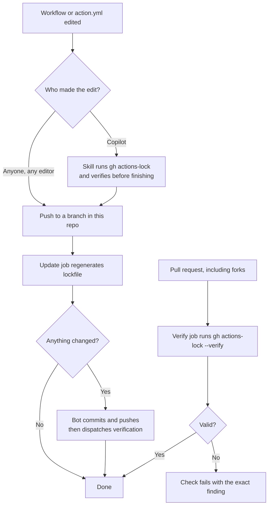

# A developer experience for locking a single repository

`gh actions-lock` is a command. This document describes one way to wrap that
command so that nobody on your team has to remember to run it.

It is a worked example, not the only design.

> [!NOTE]
> gh-actions-lock is in public preview. Flags and lockfile format may change
> between releases. Pin the automation to a release you have tested if that
> matters to you.

## The idea

Locking has to happen wherever workflow changes happen. In practice that is two
places: in the editor while someone (or Copilot) is authoring the change, and on
GitHub after the change is pushed. Covering both keeps the lockfile current
without anyone tracking it manually.

| Piece | Location | Role |
| --- | --- | --- |
| Lockfile | `.github/workflows/actions.lock` | Records the resolved ref, commit, owner ID, and repo ID for every action dependency. Machine-generated. |
| Copilot skill | `.github/skills/actions-lock/SKILL.md` | Teaches Copilot to run and verify the lock command as part of any workflow change. |
| Automation workflow | `.github/workflows/actions-lock.yml` | Regenerates and commits the lockfile on push; verifies it on pull requests. |

Ready-to-copy versions of the last two live in [`examples/`](./examples):

- [`examples/actions-lock-workflow.yml`](./examples/actions-lock-workflow.yml)
- [`examples/actions-lock-SKILL.md`](./examples/actions-lock-SKILL.md)

## How a change flows



### 1. Editing with Copilot

When you ask Copilot to add, upgrade, or remove an action, it discovers the
`actions-lock` skill and handles the lockfile itself: it runs `gh actions-lock`,
includes the generated changes in the same change set, and does not call the
task done until `gh actions-lock --verify` passes.

No terminal required for this path.

### 2. Editing by hand

Edit the workflow however you like and push to a branch. The `update` job runs
the lock command for you and, if anything changed, commits the result back to
your branch as `github-actions[bot]`. Pull afterwards:

```bash
git pull
```

> [!NOTE]
> Commits pushed with `GITHUB_TOKEN` do not trigger new `push` or
> `pull_request` runs. The update job therefore dispatches the workflow
> explicitly after committing, so the bot's own commit still gets verified.

### 3. Pull requests and forks

Every pull request touching workflows or local actions runs the read-only
`verify` job. Fork pull requests are verified but never written to, because the
pull request token cannot safely push to a fork. A contributor from a fork fixes
a stale lockfile by running `gh actions-lock` locally and pushing the result.

## What the automation actually changes

`gh actions-lock` does not only write the lockfile. On a fix run it also edits
your source files, so review the diff accordingly:

- **Workflow `uses:` refs are rewritten** to the narrowed ref it resolved. A
  freshly pinned `actions/checkout@v4` becomes `actions/checkout@v4.4.0`,
  because a full semver tag is far less likely to move than a `v4` splat. Pass
  `--no-narrow` to keep the original ref.
- **Same-repo `./…` action references are migrated to `$/…`**, in both
  workflows and in your in-repo composite `action.yml` files. `$/…` always
  resolves to the running commit of the repository, so it is inherently pinned
  and needs no lockfile entry. Pass `--no-migrate-local-actions` to opt out.

### Local actions

A `./…` reference is resolved **relative to the repository root**, not to the
directory of the file containing it. This matches how the Actions runner
resolves it:

```yaml
# my-action/action.yml
runs:
  using: composite
  steps:
    - uses: ./helper        # resolves to <repo-root>/helper, NOT my-action/helper
```

If the path resolves to a real in-repo `action.yml` or `action.yaml`, it is
migrated to `$/helper` and any third-party actions it reaches are pinned
transitively. If it does not resolve, the workflow is reported as skipped —
`local path actions are not yet supported` — and gets no lockfile entry. For a
workflow already in the lockfile, the same situation is a hard error instead of
a skip, so it fails the `verify` job rather than silently dropping coverage.

## Running it yourself

This is the same command the automation runs:

```bash
gh extension install github/gh-actions-lock
gh actions-lock
```

Installing when the extension is already present prints a warning and exits
zero, so the step is safe to repeat.

Read-only check. Writes nothing, exits non-zero when the lockfile is stale:

```bash
gh actions-lock --verify
```

Offline coverage check. No network and no token required, so it suits a
pre-commit hook. It confirms every ref has a lockfile entry, but does not
re-verify the pins themselves:

```bash
gh actions-lock --verify-local
```

Machine-readable output for scripting:

```bash
gh actions-lock --no-fix --json=valid,findings
```

## Upgrading an action

Change the `uses:` ref in the workflow, then let the automation or the skill
re-resolve it. Refs that legitimately move — branches like `main`, or partial
versions like `v4` — are trusted from the lockfile on a normal run rather than
re-resolved. Bump them deliberately:

```bash
gh actions-lock --relock
```

If a recorded commit is no longer reachable upstream, that is treated as
suspicious and left as an error. Re-resolve those with `--accept-moved`.

Dependencies bumped by Dependabot are handled separately: it updates the
workflow YAML and regenerates the matching lockfile entry in the same pull
request. See [Dependabot and the Actions lockfile](./dependabot.md).

## Rules of thumb

- Never hand-edit `.github/workflows/actions.lock`. Regenerate it instead.
- Review lockfile diffs like any other dependency change. A changed commit SHA
  is what to look at.
- If verification fails, read the reported finding rather than deleting entries
  to make it pass.

## Requirements and caveats

- The [`gh` CLI](https://cli.github.com/) on any machine that runs the command
  directly. GitHub-hosted runners already have it.
- Branch protection must allow GitHub Actions to push to branches, otherwise the
  update job cannot commit the regenerated lockfile.
- The automation grants `contents: write` only to the push-triggered update job.
  The pull request job stays read-only.
- Pushing to a branch in the same repository fires the `update` and `verify`
  jobs concurrently, under different concurrency groups. `verify` can briefly
  fail against the pre-update commit; the dispatched run after the bot commit is
  the authoritative one.
- Repositories that do not want a bot commit on every workflow edit should drop
  the `update` job and keep only `verify`, making a stale lockfile a failed
  check that the author fixes locally.

## Related

- [Rolling out lockfiles across an enterprise](./enterprise-rollout.md)
- [Dependabot and the Actions lockfile](./dependabot.md)
